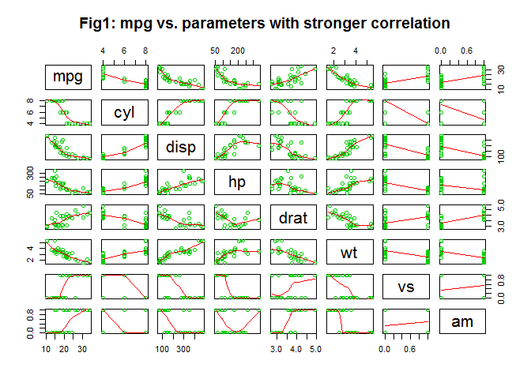
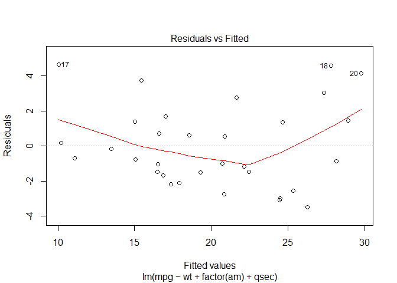
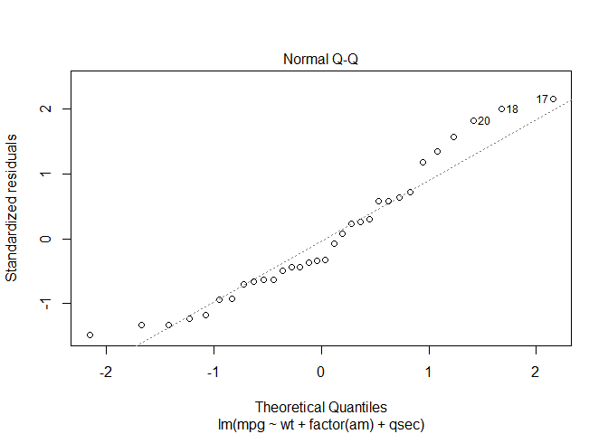

# Regression Models Course Project
Kenneth Lim  
Tuesday, July 21, 2015  

---

## Executive summary
Here we look at Motor Trend Car Road Tests (mtcars) dataset on a collection of cars and explore the relationship between a set of vairables and miles per gallon (MPG).  In particular, we are interested in addressing the 2 questions:

* Is an automatic or manual transmission better for MPG
* Quantify the MPG difference between automatic and manual transmissions

To do so, we shall use the following strategy:

1. Performing some exploratory data analyses
2. Fit multiple multivariable models by using only variables which have the highest correlations with mpg as confounders along with 'am' as the predictor.
3. Finding the best linear fit by using "step" function.
4. Examining the residuals and performing some diagnostics.
5. Quantifying the uncertainty in the final multivariable linear model and making the final inference.


## Data Exploration

First, we look at the correlation between mpg and all other variables in the dataset.


```r
attach(mtcars)
head(mtcars,5)
sapply(mtcars,function(x) cor(mpg,x))
```

*See Results 1 in Appendix.*

Apparently only three variables have weaker correlation with mpg than 'am'. We will ignore these variables for our exploratory analysis since they contain less information than other variables. In Figure 1 in Appendix, we show the correlations between mpg and variables with strong correlations.


```r
library(stats)
library(graphics)
# pairs(mtcars[c('mpg','cyl','disp','hp','drat','wt','vs','am')], panel=panel.smooth,
#       main='Fig1: mpg vs. parameters with stronger correlation', col = 3)
```

*See Figure 1 in Appendix.*

## Fitting Models Exploration

We start simple with fitting a linear model with mpg as the outcome and 'am' as the predictor.  


```r
lm1 <- lm(mpg ~ factor(am))
summary(lm1)$coef ; print(c('R-squared',round(summary(lm1)$r.sq,2)))
```

*See Results 2a in Appendix.*

Although the p-values are significantly small, the R-squared shows that the model fit is not a good solution. However, there is a tentative correlation between the mpg and transmission type with manual transmissions having higher mpg (~7 Miles/gallon.) This correlation can be seen also in the top right panel of Figure 1.

But, as mentioned before, this model fit is too simplistic and we need to take the correlation between 'am', mpg and other variables into account. Therefore, we add a confounder to our linear model fit. We pick weight (wt) as it is has the highest correlation with mpg.


```r
lm2 <- lm(mpg ~ factor(am) + wt)
summary(lm2)$coef; print(c('R-squared',round(summary(lm2)$r.sq,2)))
```

*See Results 2b in Appendix.*

As expected, the R-squared has improved significantly. On the other hand, 'am' p-values has decreased immensely and even the coefficient has switch its sing. Based on this 'am' p-value, we cannot reject the null hypothesis and so the previously observed correlation between mpg and 'am' is gone.

Let's add the second most correlated variable (cyl) to mpg as a confounder in our model fit. Note that, adding cyl as the second confounder may not lead to the best solution as we are not taking into account the correlation among the confounder themselves to avoid for example variance inflation. But for exploratory purposes, it is less important.


```r
lm3 <- lm(mpg ~ factor(am) + wt + factor(cyl))
summary(lm3)$coef; print(c('R-squared',round(summary(lm3)$r.sq,2)))

anova(lm2,lm3)
```

*See Results 2c in Appendix.*

The R-squared again has had noticeable improvement as a result of adding another confounder. Furthermore, the analysis of variance (ANOVA) confirms that adding 'cyl' as the coufounder leads to a significant better linear fit.

The 'am' coefficient sign flipped one more time but the p-value is still high enough to not being able to reject the null hypothesis.


## Finding The Best Linear Fit

We take advantage of the step function to find the best linear fit.


```r
full.model <- lm(mpg ~ ., data=mtcars)
stepSolution <- step(full.model, direction="backward")

best.model <- stepSolution$call
best.model
```

*See Results 3a in Appendix.*

So, therefore using wt, am, and qsec we can find the best model fit.


```r
lm.best <- lm(mpg ~ wt + factor(am) + qsec)
summary(lm.best)$coef;print(c('R-squared',round(summary(lm.best)$r.sq,2)))
```

*See Results 3b in Appendix.*

Regarding the 'am', the p-value is smaller than 0.05 and therefore in 95% interval, we can reject the null hypothesis. Therefore, cars with manual transmissions have slightly better mpgs (~3 Miles/gallon.)

The R-squared indicates a reliable fit. We need to look at the residuals to make sure there is no indication of unaccounted variables in our model fit. In order words, we have to make sure there is no pattern in residuals.


```r
# plot(lm.best,which=1)
```

*See Figure 3c in Appendix.*

The plots shows that our fit is robust and therefore our final inference is reliable.

Finally, we need to confirm that the assumption that the residuals have normal distribution is a good approximation. We do so but examining the QQ plot.


```r
# plot(lm.best,which=2)
```

*See Figure 3d in Appendix.*

It can be seen that the standardized residuals mimic a normal distribution and therefore our statistical inferences are valid.

## Summary

Assuming that the step-function solution finds the best model, based on mtcars data, cars with manual transmissions have slightly better mpgs (~3 Miles/gallon.)

## Appendix

### Results 1

```r
attach(mtcars)
```

```
## The following objects are masked from mtcars (pos = 3):
## 
##     am, carb, cyl, disp, drat, gear, hp, mpg, qsec, vs, wt
```

```r
head(mtcars,5)
```

```
##                    mpg cyl disp  hp drat    wt  qsec vs am gear carb
## Mazda RX4         21.0   6  160 110 3.90 2.620 16.46  0  1    4    4
## Mazda RX4 Wag     21.0   6  160 110 3.90 2.875 17.02  0  1    4    4
## Datsun 710        22.8   4  108  93 3.85 2.320 18.61  1  1    4    1
## Hornet 4 Drive    21.4   6  258 110 3.08 3.215 19.44  1  0    3    1
## Hornet Sportabout 18.7   8  360 175 3.15 3.440 17.02  0  0    3    2
```

```r
sapply(mtcars,function(x) cor(mpg,x))
```

```
##        mpg        cyl       disp         hp       drat         wt 
##  1.0000000 -0.8521620 -0.8475514 -0.7761684  0.6811719 -0.8676594 
##       qsec         vs         am       gear       carb 
##  0.4186840  0.6640389  0.5998324  0.4802848 -0.5509251
```

### Figure 1

```r
library(stats)
library(graphics)
pairs(mtcars[c('mpg','cyl','disp','hp','drat','wt','vs','am')], panel=panel.smooth,
      main='Fig1: mpg vs. parameters with stronger correlation', col = 3)
```

 

### Results 2a

```r
lm1 <- lm(mpg ~ factor(am))
summary(lm1)$coef ; print(c('R-squared',round(summary(lm1)$r.sq,2)))
```

```
##              Estimate Std. Error   t value     Pr(>|t|)
## (Intercept) 17.147368   1.124603 15.247492 1.133983e-15
## factor(am)1  7.244939   1.764422  4.106127 2.850207e-04
```

```
## [1] "R-squared" "0.36"
```

### Results 2b

```r
lm2 <- lm(mpg ~ factor(am) + wt)
summary(lm2)$coef; print(c('R-squared',round(summary(lm2)$r.sq,2)))
```

```
##                Estimate Std. Error     t value     Pr(>|t|)
## (Intercept) 37.32155131  3.0546385 12.21799285 5.843477e-13
## factor(am)1 -0.02361522  1.5456453 -0.01527855 9.879146e-01
## wt          -5.35281145  0.7882438 -6.79080719 1.867415e-07
```

```
## [1] "R-squared" "0.75"
```

### Results 2c

```r
lm3 <- lm(mpg ~ factor(am) + wt + factor(cyl))
summary(lm3)$coef; print(c('R-squared',round(summary(lm3)$r.sq,2)))
```

```
##                Estimate Std. Error    t value     Pr(>|t|)
## (Intercept)  33.7535920  2.8134831 11.9970836 2.495549e-12
## factor(am)1   0.1501031  1.3002231  0.1154441 9.089474e-01
## wt           -3.1495978  0.9080495 -3.4685309 1.770987e-03
## factor(cyl)6 -4.2573185  1.4112394 -3.0167231 5.514697e-03
## factor(cyl)8 -6.0791189  1.6837131 -3.6105432 1.227964e-03
```

```
## [1] "R-squared" "0.84"
```

```r
anova(lm2,lm3)
```

```
## Analysis of Variance Table
## 
## Model 1: mpg ~ factor(am) + wt
## Model 2: mpg ~ factor(am) + wt + factor(cyl)
##   Res.Df    RSS Df Sum of Sq      F   Pr(>F)   
## 1     29 278.32                                
## 2     27 182.97  2    95.351 7.0353 0.003473 **
## ---
## Signif. codes:  0 '***' 0.001 '**' 0.01 '*' 0.05 '.' 0.1 ' ' 1
```

### Results 3a

```r
full.model <- lm(mpg ~ ., data=mtcars)
stepSolution <- step(full.model, direction="backward")
```

```
## Start:  AIC=70.9
## mpg ~ cyl + disp + hp + drat + wt + qsec + vs + am + gear + carb
## 
##        Df Sum of Sq    RSS    AIC
## - cyl   1    0.0799 147.57 68.915
## - vs    1    0.1601 147.66 68.932
## - carb  1    0.4067 147.90 68.986
## - gear  1    1.3531 148.85 69.190
## - drat  1    1.6270 149.12 69.249
## - disp  1    3.9167 151.41 69.736
## - hp    1    6.8399 154.33 70.348
## - qsec  1    8.8641 156.36 70.765
## <none>              147.49 70.898
## - am    1   10.5467 158.04 71.108
## - wt    1   27.0144 174.51 74.280
## 
## Step:  AIC=68.92
## mpg ~ disp + hp + drat + wt + qsec + vs + am + gear + carb
## 
##        Df Sum of Sq    RSS    AIC
## - vs    1    0.2685 147.84 66.973
## - carb  1    0.5201 148.09 67.028
## - gear  1    1.8211 149.40 67.308
## - drat  1    1.9826 149.56 67.342
## - disp  1    3.9009 151.47 67.750
## - hp    1    7.3632 154.94 68.473
## <none>              147.57 68.915
## - qsec  1   10.0933 157.67 69.032
## - am    1   11.8359 159.41 69.384
## - wt    1   27.0280 174.60 72.297
## 
## Step:  AIC=66.97
## mpg ~ disp + hp + drat + wt + qsec + am + gear + carb
## 
##        Df Sum of Sq    RSS    AIC
## - carb  1    0.6855 148.53 65.121
## - gear  1    2.1437 149.99 65.434
## - drat  1    2.2139 150.06 65.449
## - disp  1    3.6467 151.49 65.753
## - hp    1    7.1060 154.95 66.475
## <none>              147.84 66.973
## - am    1   11.5694 159.41 67.384
## - qsec  1   15.6830 163.53 68.200
## - wt    1   27.3799 175.22 70.410
## 
## Step:  AIC=65.12
## mpg ~ disp + hp + drat + wt + qsec + am + gear
## 
##        Df Sum of Sq    RSS    AIC
## - gear  1     1.565 150.09 63.457
## - drat  1     1.932 150.46 63.535
## <none>              148.53 65.121
## - disp  1    10.110 158.64 65.229
## - am    1    12.323 160.85 65.672
## - hp    1    14.826 163.35 66.166
## - qsec  1    26.408 174.94 68.358
## - wt    1    69.127 217.66 75.350
## 
## Step:  AIC=63.46
## mpg ~ disp + hp + drat + wt + qsec + am
## 
##        Df Sum of Sq    RSS    AIC
## - drat  1     3.345 153.44 62.162
## - disp  1     8.545 158.64 63.229
## <none>              150.09 63.457
## - hp    1    13.285 163.38 64.171
## - am    1    20.036 170.13 65.466
## - qsec  1    25.574 175.67 66.491
## - wt    1    67.572 217.66 73.351
## 
## Step:  AIC=62.16
## mpg ~ disp + hp + wt + qsec + am
## 
##        Df Sum of Sq    RSS    AIC
## - disp  1     6.629 160.07 61.515
## <none>              153.44 62.162
## - hp    1    12.572 166.01 62.682
## - qsec  1    26.470 179.91 65.255
## - am    1    32.198 185.63 66.258
## - wt    1    69.043 222.48 72.051
## 
## Step:  AIC=61.52
## mpg ~ hp + wt + qsec + am
## 
##        Df Sum of Sq    RSS    AIC
## - hp    1     9.219 169.29 61.307
## <none>              160.07 61.515
## - qsec  1    20.225 180.29 63.323
## - am    1    25.993 186.06 64.331
## - wt    1    78.494 238.56 72.284
## 
## Step:  AIC=61.31
## mpg ~ wt + qsec + am
## 
##        Df Sum of Sq    RSS    AIC
## <none>              169.29 61.307
## - am    1    26.178 195.46 63.908
## - qsec  1   109.034 278.32 75.217
## - wt    1   183.347 352.63 82.790
```

```r
best.model <- stepSolution$call
best.model
```

```
## lm(formula = mpg ~ wt + qsec + am, data = mtcars)
```

### Results 3b

```r
lm.best <- lm(mpg ~ wt + factor(am) + qsec)
summary(lm.best)$coef;print(c('R-squared',round(summary(lm.best)$r.sq,2)))
```

```
##              Estimate Std. Error   t value     Pr(>|t|)
## (Intercept)  9.617781  6.9595930  1.381946 1.779152e-01
## wt          -3.916504  0.7112016 -5.506882 6.952711e-06
## factor(am)1  2.935837  1.4109045  2.080819 4.671551e-02
## qsec         1.225886  0.2886696  4.246676 2.161737e-04
```

```
## [1] "R-squared" "0.85"
```

### Figure 3c

```r
plot(lm.best,which=1)
```

 

### Figure 3d

```r
plot(lm.best,which=2)
```

 
