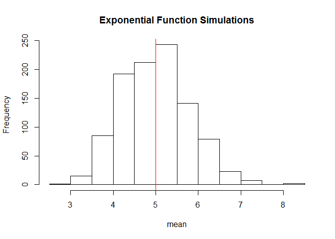
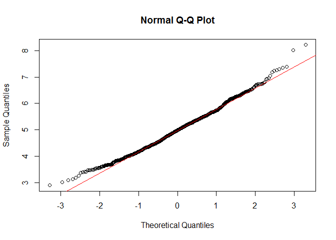
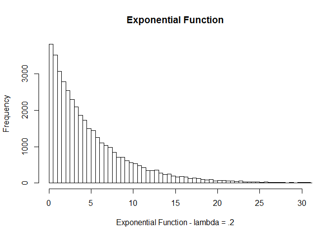

# Statistical Inference - Course Project Part 1
Kenneth Lim  
Sunday, June 21, 2015  


## Exponential distribution in R with comparision with the Central Limit Theorem
## Overview
In this project we will investigate the exponential distribution in R and compare it with the Central Limit Theorem. The exponential distribution can be simulated in R with rexp(n, lambda) where lambda is the rate parameter. The mean of exponential distribution is 1/lambda and the standard deviation is also 1/lambda. Set lambda = 0.2 for all of the simulations. We will investigate the distribution of averages of 40 exponentials. Note that we will need to do a thousand simulations.
 
 

### Sample Mean versus Theoretical Mean
 
We are interested in the properties of the distribution of means of repeated simulation of the exponential function with an arbitrary lambda.

In this particular case we will invoke the exponential function 40 times, using 0.2 as the lambda, and perform 1000 of such simulations.
 

```r
set.seed(31)

lambda <- 0.2
n <- 40
simulations <- 1000

x <- sapply(1:simulations, FUN = function(x) mean(rexp(40, lambda)))

sample_mean <- mean(x)

hist(x, xlab = "mean", main = "Exponential Function Simulations")
abline(v = sample_mean, col = "red")
```

 
 
We can see that the distribution of the sample means is a normal distribution, which is centered at the mean of the sample means, 4.9938666. This is expected, as the theoretical mean of the exponential function is 1 / lambda, which in this case would be 1 / .2 or 5.


### Sample Variance versus Theoretical Variance

Likewise, the theoretical standard deviation of the exponential function is (1 / lambda) / sqrt(n), which in this particular case would be 1 / .2 / sqrt(40), or 0.7905694. As with the observed mean, the actual standard deviation is very close, NA.

The quantile plot offers another view of the normal distribution of the observed sample means from these simulations:
 

```r
qqnorm(x)
qqline(x, col = "red")
```

 


### Distribution

Above, we ran 1000 simulations of invoking the exponential function 40 times, taking the mean of each simulation run. If we had simply invoked the exponential function 40,000 times and observed the mean, what would it be?


```r
mean(rexp(40000, lambda))
```

```
## [1] 5.034524
```

It would be very close to 1 / lambda, or 5 in this case. But what if we only looked at one simulation of the exponential function?


```r
mean(rexp(40, lambda))
```

```
## [1] 6.50177
```

The mean would not necessarily be so close to the theoretical of 5, and in fact could be a fair bit off. Performing 1000 simulations, we are seeing the Central Limit Theorem in action. Each individual simulation mean may not be particularly close to the theoretical mean of the distribution of the random variable we are concerned with, the exponential in this case, but as we perform more and more simulations, the mean of each of those random variables does converge towards the theoretical mean, and that random variable is normally distributed, regardless of which type of distribution it is summarizing. Below we can see that 40,000 invocations of the exponential function with the given lambda does indeed yield a mean very close to the theoretical mean, albeit with a very different shaped distribution.


```r
x <- rexp(40000, .2)
mean(x)
```

```
## [1] 5.024598
```

```r
hist(x, 
     breaks = 100, 
     xlim = range(0, 30),
     main = "Exponential Function",
     xlab = "Exponential Function - lambda = .2")
```

 
