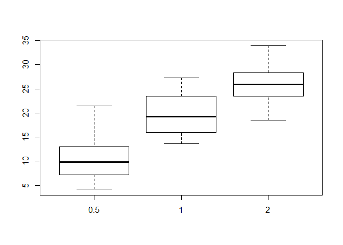
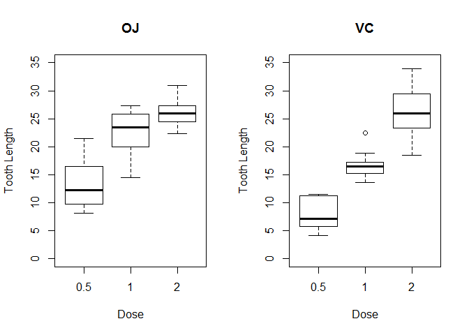
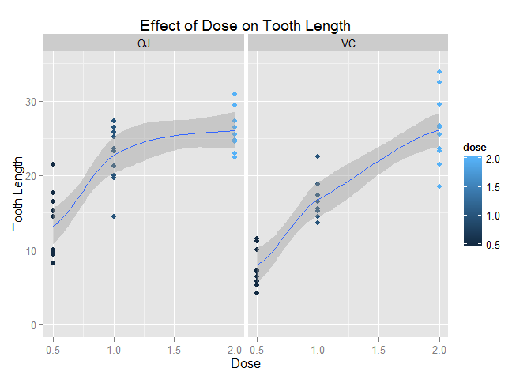
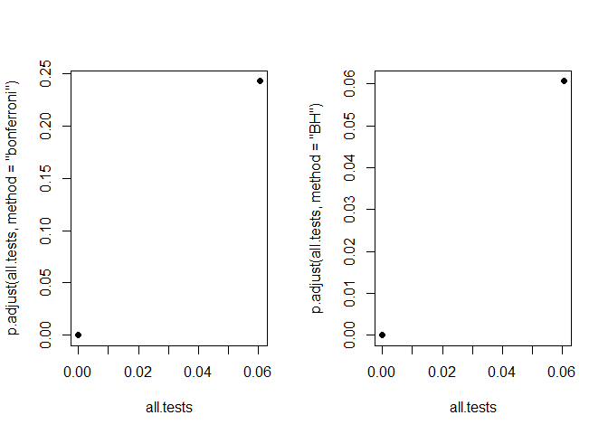

# Statistical Inference - Course Project Part 2
Kenneth Lim  
Sunday, June 21, 2015  

## Analysis of the ToothGrowth data

## Overview
The data  presented is measuring "The Effect of Vitamin C on Tooth Growth in Guinea Pigs." The response is the length of odontoblasts (teeth) in each of 10 guinea pigs at each of three dose levels of Vitamin C (0.5, 1, and 2 mg) with each of two delivery methods (orange juice or ascorbic acid).

We are interested to know the effect of dosage and delivery method on tooth growth.


```r
knitr::opts_chunk$set(warning=FALSE)
```


### Basic exploratory data analyses

We begin with a cursory glance at the data.


```r
summary(ToothGrowth)
```

```
##       len        supp         dose      
##  Min.   : 4.20   OJ:30   Min.   :0.500  
##  1st Qu.:13.07   VC:30   1st Qu.:0.500  
##  Median :19.25           Median :1.000  
##  Mean   :18.81           Mean   :1.167  
##  3rd Qu.:25.27           3rd Qu.:2.000  
##  Max.   :33.90           Max.   :2.000
```

```r
head(ToothGrowth)
```

```
##    len supp dose
## 1  4.2   VC  0.5
## 2 11.5   VC  0.5
## 3  7.3   VC  0.5
## 4  5.8   VC  0.5
## 5  6.4   VC  0.5
## 6 10.0   VC  0.5
```

```r
tail(ToothGrowth)
```

```
##     len supp dose
## 55 24.8   OJ    2
## 56 30.9   OJ    2
## 57 26.4   OJ    2
## 58 27.3   OJ    2
## 59 29.4   OJ    2
## 60 23.0   OJ    2
```

```r
boxplot(len ~ dose, ToothGrowth)
```

 


### Basic summary of the data

This dataset contains two factors in the `supp` variable, representing the two different delivery methods. Therefore we should look at some summary statistics for each of the two factors taken separately.
 

```r
oj <- levels(ToothGrowth$supp)[1]
vc <- levels(ToothGrowth$supp)[2]

summary(ToothGrowth[ToothGrowth$supp == oj,])
```

```
##       len        supp         dose      
##  Min.   : 8.20   OJ:30   Min.   :0.500  
##  1st Qu.:15.53   VC: 0   1st Qu.:0.500  
##  Median :22.70           Median :1.000  
##  Mean   :20.66           Mean   :1.167  
##  3rd Qu.:25.73           3rd Qu.:2.000  
##  Max.   :30.90           Max.   :2.000
```

```r
summary(ToothGrowth[ToothGrowth$supp == vc,])
```

```
##       len        supp         dose      
##  Min.   : 4.20   OJ: 0   Min.   :0.500  
##  1st Qu.:11.20   VC:30   1st Qu.:0.500  
##  Median :16.50           Median :1.000  
##  Mean   :16.96           Mean   :1.167  
##  3rd Qu.:23.10           3rd Qu.:2.000  
##  Max.   :33.90           Max.   :2.000
```

```r
par(mfrow = c(1, 2))
boxplot(len ~ dose, 
        ToothGrowth[ToothGrowth$supp == oj,], 
        main="OJ", 
        xlab="Dose", 
        ylab="Tooth Length", 
        ylim=range(0,35))
boxplot(len ~ dose, 
        ToothGrowth[ToothGrowth$supp == vc,], 
        main="VC", 
        xlab="Dose", 
        ylab="Tooth Length", 
        ylim=range(0,35))

library(ggplot2)
```

 

```r
qplot(dose, len, 
      data = ToothGrowth,
      facets = . ~ supp,
      geom = c("point", "smooth"), 
      method = "loess", 
      formula = y ~ x, 
      color = dose, 
      ylim = c(0, 35),
      main = "Effect of Dose on Tooth Length",
      xlab = "Dose", 
      ylab = "Tooth Length") 
```

 


### Confidence intervals and hypothesis tests

Looking at these figures it seems quite probable that dose has an effect on tooth length, but it's not clear what role delivery method plays. Looking at the figure however reveals that dose is not really a continuous variable, but rather a categorical. We therefore convert dose in our dataset to a factor.


```r
ToothGrowth$dose <- as.factor(ToothGrowth$dose)
```

First we'll look at the effect of delivery method to determine if in fact it has any significant effect on tooth length. We'll perform a t test, but first we need to determine if the variances between the two groups are roughly equal.


```r
sapply(split(ToothGrowth$len, ToothGrowth$supp), var)
```

```
##       OJ       VC 
## 43.63344 68.32723
```

**Assumptions:**  
* They seem rather far apart, so we assume that the group variances are not equal.  
* Also note that for all of the statistical methods performed throughtout, we assume that subjects were randomly assigned to the various groups.


```r
supp.test <- t.test(ToothGrowth$len[ToothGrowth$supp=="VC"], 
                    ToothGrowth$len[ToothGrowth$supp=="OJ"], 
                    paired = F, 
                    var.equal = F)
supp.test
```

```
## 
## 	Welch Two Sample t-test
## 
## data:  ToothGrowth$len[ToothGrowth$supp == "VC"] and ToothGrowth$len[ToothGrowth$supp == "OJ"]
## t = -1.9153, df = 55.309, p-value = 0.06063
## alternative hypothesis: true difference in means is not equal to 0
## 95 percent confidence interval:
##  -7.5710156  0.1710156
## sample estimates:
## mean of x mean of y 
##  16.96333  20.66333
```

A 0.06 p value, a small-ish t statistic, and the 95% confidence interval including zero all indicate that we must fail to reject the null hypothesis, and we must assume that these differences could be due to chance.
 
So now we need to test the effect of dose on tooth length. For this, we'll need to do a two sample t test for each of the three comparisons possible for the three dosage groups.


```r
sapply(split(ToothGrowth$len, ToothGrowth$dose), var)
```

```
##      0.5        1        2 
## 20.24787 19.49608 14.24421
```

The variances of the three dosages groups are relatively close, so we can assume the variance is equal.


```r
dose.groups <- split(ToothGrowth$len, ToothGrowth$dose)

point.five.one.test <- t.test(dose.groups[["0.5"]], 
                              dose.groups[["1"]],
                              paired = F, 
                              var.equal = T)
point.five.one.test
```

```
## 
## 	Two Sample t-test
## 
## data:  dose.groups[["0.5"]] and dose.groups[["1"]]
## t = -6.4766, df = 38, p-value = 1.266e-07
## alternative hypothesis: true difference in means is not equal to 0
## 95 percent confidence interval:
##  -11.983748  -6.276252
## sample estimates:
## mean of x mean of y 
##    10.605    19.735
```


### Conclusions

With a very small p value well below 0.05 and confidence interval between -11.983748 and -6.276252, we can reject the null hypothesis and conclude that dosage may have an effect on tooth length for the 0.5 and 1.0 dosage groups.


```r
one.two.test <- t.test(dose.groups[["1"]], 
                       dose.groups[["2"]],
                       paired = F, 
                       var.equal = T)
one.two.test
```

```
## 
## 	Two Sample t-test
## 
## data:  dose.groups[["1"]] and dose.groups[["2"]]
## t = -4.9005, df = 38, p-value = 1.811e-05
## alternative hypothesis: true difference in means is not equal to 0
## 95 percent confidence interval:
##  -8.994387 -3.735613
## sample estimates:
## mean of x mean of y 
##    19.735    26.100
```

Similarly, the t test for the 1.0 and 2.0 dosage groups yields a p value less than 0.05 and confidence interval which does not contain zero, so we can reject the null hypothesis and conclude that dosage may have an effect on tooth length for the 1.0 and 2.0 dosage groups.

And of course, the t test for the 0.5 and 2.0 dosage groups will lead us to reject the null hypothesis as well.


```r
point.five.two.test <- t.test(dose.groups[["0.5"]], 
                              dose.groups[["2"]],
                              paired = F, 
                              var.equal = T)
point.five.two.test
```

```
## 
## 	Two Sample t-test
## 
## data:  dose.groups[["0.5"]] and dose.groups[["2"]]
## t = -11.799, df = 38, p-value = 2.838e-14
## alternative hypothesis: true difference in means is not equal to 0
## 95 percent confidence interval:
##  -18.15352 -12.83648
## sample estimates:
## mean of x mean of y 
##    10.605    26.100
```

Finally, to control for family-wise error rate we use the Bonferroni correction as follows:


```r
all.tests <- c(supp.test$p.value, 
               point.five.one.test$p.value, 
               one.two.test$p.value, 
               point.five.two.test$p.value)

sum(p.adjust(all.tests, method = "bonferroni") < 0.05)
```

```
## [1] 3
```

```r
round(p.adjust(all.tests, method = "bonferroni"), 3)
```

```
## [1] 0.243 0.000 0.000 0.000
```

And to control for false discovery rate we use the BH correction:


```r
sum(p.adjust(all.tests, method = "BH") < 0.05)
```

```
## [1] 3
```

```r
round(p.adjust(all.tests, method = "BH"), 3)
```

```
## [1] 0.061 0.000 0.000 0.000
```

```r
par(mfrow = c(1, 2))
plot(all.tests, p.adjust(all.tests, method = "bonferroni"), pch = 19)
plot(all.tests, p.adjust(all.tests, method = "BH"), pch = 19)
```

 


